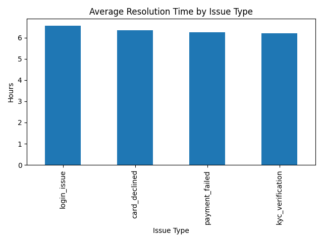
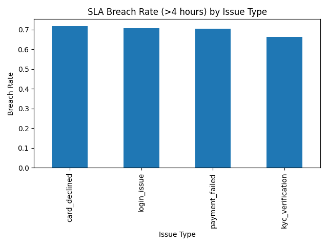

# Ops Analytics Starter: Support & Onboarding Metrics (SQL + Python)

This project analyses customer support and onboarding metrics to identify operational bottlenecks and improvement opportunities.  
The goal is to demonstrate how SQL and Python can be used to generate operational insights similar to those used by Strategy & Operations teams.

---

## Project Goals

- Analyse customer support performance
- Identify onboarding drop-off points
- Measure operational KPIs
- Generate insights that could improve operational efficiency

---

## Tools & Skills Used

### SQL
- Joins
- Group By aggregation
- Window functions
- CASE WHEN logic
- Common Table Expressions (CTEs)

### Python
- Pandas for data manipulation
- Matplotlib for visualisation
- Data cleaning and exploratory analysis

### Operational Analysis
- KPI definition
- Funnel analysis
- SLA monitoring
- Operational improvement insights

---

## Repository Structure

```
data/        → datasets used for analysis
sql/         → SQL queries analysing operational metrics
notebooks/   → Python analysis and visualisations
outputs/     → charts and analysis outputs
```

## Example Visual Outputs



## How to run

1. Download the repo (or clone it)
2. Install requirements:
   - pandas
   - matplotlib
3. Run:
   - notebooks/support_analysis.py
